# Aravalli Range Delineation Comparison Tool

> **⚠️ IMPORTANT LEGAL STATUS (as of 29 December 2025):**  
> The "NEW" operational definition (SC Order dated 20-Nov-2025) has been **kept in abeyance** by a subsequent Supreme Court order dated **29-Dec-2025**. A high-powered committee has been constituted for reassessment. The FSI-2010 constraints continue to apply for mining activities. Treat the 2025 definition as **paused pending finality**.

---

## Table of Contents

1. [Problem Statement](#1-problem-statement)
2. [Legal Context & Sources](#2-legal-context--sources)
3. [Data Sources](#3-data-sources)
4. [Methodology](#4-methodology)
5. [Installation & Setup](#5-installation--setup)
6. [Usage (CLI)](#6-usage-cli)
7. [Expected Outputs](#7-expected-outputs)
8. [Results Interpretation](#8-results-interpretation)
9. [Limitations & Caveats](#9-limitations--caveats)
10. [License & Citation](#10-license--citation)

---

## 1. Problem Statement

This repository provides tools to **compare two operational definitions** of the Aravalli Hills/Range:

| Definition | Source | Status |
|------------|--------|--------|
| **OLD (FSI-like)** | Forest Survey of India methodology (2010), as referenced in SC proceedings | Currently applicable (FSI-2010 constraints continue for mining per SC order 29-Dec-2025) |
| **NEW (20-Nov-2025)** | Supreme Court judgment dated 20-Nov-2025 | **In abeyance** since 29-Dec-2025; pending high-powered committee review |

### Why Compare?

The legal definition of "Aravalli Hills" directly affects:
- **Mining permissions** in Haryana, Rajasthan, Gujarat, and Delhi NCT
- **Environmental protection** zones and forest conservation efforts
- **Land use planning** in "Aravalli districts"

The two definitions yield significantly different geographic extents. This tool provides:
- Reproducible GIS layers for both definitions
- Quantitative area comparisons per district
- Elevation distribution analysis
- Inter-hill distance metrics
- Publication-ready maps

### Why This Project?

The Aravalli Mountain Range is **one of the world's oldest fold mountain systems** (formed ~3.5 billion years ago) and serves as a critical ecological barrier against desertification in northwestern India. Its legal definition directly determines:

- **Environmental protection extent**: Over 89,000 km² of potential conservation zones across 34 districts
- **Mining permissions**: Where mineral extraction can legally occur
- **Land use planning**: Development restrictions in ecologically sensitive zones
- **Climate mitigation**: Forest cover maintenance and groundwater recharge areas

This repository provides **reproducible, open-source geospatial analysis** to:

1. **Quantify land loss** from definition changes: The shift from the FSI-2010-like methodology (OLD) to the SC 20-Nov-2025 definition (NEW) results in **~91.9% reduction** in protected area—from 89,065 km² to 7,192 km²
2. **Enable scientific transparency**: All methodology, code, and data sources are public and verifiable
3. **Support evidence-based policy**: Provide GIS layers and statistical summaries for environmental agencies, legal teams, and advocacy organizations
4. **Document uncertainty**: Clearly state data limitations, approximations, and when litigation-grade surveys are needed

**Current Status**: Both definitions are subject to ongoing legal review following the SC's 29-Dec-2025 abeyance order. This tool enables stakeholders to understand the spatial implications of each approach.

---

## 2. Legal Context & Sources

### 2.1 NEW Definition (20-Nov-2025 SC Judgment)

The Supreme Court of India, in its order dated **20 November 2025**, accepted an operational definition:

> **Aravalli Hills**: Landforms in "Aravalli districts" with **≥100 m elevation from local relief**, where:
> - **Local relief** = elevation measured from the **lowest contour line encircling the landform**
> - The landform inside that contour (plus supporting slopes/associated landforms) is included

> **Aravalli Range**: Two or more such hills within **500 m proximity** (measured between hill footprint boundaries); intervening landforms are also included.

**Citation**: Supreme Court of India, *In Re: Issue Relating to Definition of Aravali Hills and Ranges*, 2025 INSC 1338, I.A. No. 105701 of 2024 (CEC Report No. 03 of 2024) in W.P.(C) No. 202 of 1995 (*In Re: T.N. Godavarman Thirumulpad*), Judgment dated 20-Nov-2025.

### 2.2 Abeyance Status (29-Dec-2025)

> The Supreme Court, in a subsequent order dated **29 December 2025**, has kept the 20-Nov-2025 directions **in abeyance** and constituted a high-powered committee for reassessment and clarification.

**Citation**: Supreme Court of India, Suo Motu W.P.(C) No. 10 of 2025, *In Re: Definition of Aravalli Hills and Ranges and Ancillary Issues*, Order dated 29-Dec-2025.

**Media Coverage**: [The Economic Times - "Aravalli Hills case: SC stays decision regarding '100-metre definition'"](https://m.economictimes.com/news/india/aravalli-hills-case-sc-puts-its-decision-regarding-100-metre-definition-of-ranges-in-abeyance/articleshow/126225402.cms)

**Implication**: The FSI-2010 methodology continues to be the operative constraint for mining activities until further orders.

### 2.3 OLD/FSI-like Definition (2010 Reference)

Based on methodology referenced in Forest Survey of India status reports (2010) and legal explainers:

| Parameter | Value | Description |
|-----------|-------|-------------|
| Slope threshold | > 3° | Terrain classified as "hill" if slope exceeds 3 degrees |
| Foothill buffer | 100 m | Buffer zone around identified slope areas |
| **Urban Filter** | **OSM Mask** | **[NEW]** Residential/Industrial/Commercial areas are masked out |
| Valley/Gap bridging | 500 m | Gaps/valleys up to 500 m are bridged (morphological closing) |

### Optimization Note (v2.1)
The pipeline now uses **Raster-based Morphological Operations** (scipy.ndimage) instead of vector buffering for 100x performance improvement. It also integrates **OSM Land Use** data to filter out urban sprawl.

**⚠️ Approximation Notice**: This implementation is a **best-effort geometric approximation** of FSI methodology. The actual FSI methodology may involve additional criteria, ground-truthing, and Survey of India (SOI) toposheets that are not publicly available.

**Secondary sources referenced**:
- Citizens' Report on Aravalli mining (for Haryana district list)
- Legal explainers discussing the FSI 2010 parameters

### 2.4 Aravalli Districts

The Aravalli Range spans approximately **38 districts** across four states and Delhi NCT. The complete list is maintained in `data/districts.yml`.

#### Summary by State

| State | Districts | Key Areas |
|-------|-----------|-----------|
| **Haryana** | 7 | Nuh, Faridabad, Gurugram, Rewari, Mahendragarh, Charkhi Dadri, Bhiwani |
| **Rajasthan** | 18 | Alwar, Jaipur, Ajmer, Sikar, Jhunjhunu, Udaipur, Rajsamand, Bhilwara, Sirohi (Mt. Abu), Pali, Dungarpur, Banswara, Pratapgarh, Chittorgarh, Dausa, Tonk, Sawai Madhopur, Nagaur |
| **Gujarat** | 5 | Aravalli, Sabarkantha, Banaskantha, Mahesana, Panchmahal |
| **Delhi NCT** | 4 | South Delhi, South West Delhi, Central Delhi, New Delhi |
| **Total** | **34 confirmed** | Additional 4 districts pending verification |

#### Sources

- **Haryana**: Citizens' Report on Aravalli Mining (2024); MoEFCC mining ban 2009; 1992 Aravalli Notification
- **Rajasthan**: MoEFCC; rajras.in; Wikipedia; PIB
- **Gujarat**: MoEFCC (moef.gov.in); arvalli.nic.in; Wikipedia
- **Delhi**: MoEFCC; Wikipedia (Delhi Ridge)

#### Key Landmarks

| Landmark | District | Significance |
|----------|----------|--------------|
| **Guru Shikhar (1,722m)** | Sirohi, Rajasthan | Highest peak of Aravalli Range |
| **Sariska Tiger Reserve** | Alwar, Rajasthan | Major wildlife sanctuary |
| **Kumbhalgarh Fort** | Rajsamand, Rajasthan | UNESCO World Heritage Site |
| **Delhi Ridge** | South/Central Delhi | Northernmost Aravalli extension |
| **Asola Bhatti Wildlife Sanctuary** | South Delhi | Protected Aravalli habitat |
| **Tosham Hills** | Bhiwani, Haryana | Northwestern Aravalli terminus |

---

## 3. Data Sources

### 3.1 Digital Elevation Model (DEM)

| Source | Resolution | Vertical Accuracy | Notes |
|--------|------------|-------------------|-------|
| **SRTM (Baseline)** | 1 arc-second (~30 m) | ±16 m (RMSE) | Free, global coverage via `elevation` package |
| **User-provided DEM** | Variable | Variable | Specify path via `--dem-path` option |

**Caveats**:
- SRTM has an absolute vertical accuracy of ~16m; relative accuracy within local areas is better (~6m)
- SRTM represents a Digital Surface Model (DSM) from 2000; vegetation canopy and buildings may inflate elevations
- For litigation-grade mapping, **Survey of India contours** (5m or 10m intervals) would be required

**Download**: SRTM data is automatically fetched and cached by the `elevation` package during runtime.

### 3.2 District Boundaries

| Priority | Source | Format | Notes |
|----------|--------|--------|-------|
| **Preferred** | Survey of India / Census of India official shapefiles | SHP/GeoJSON | Requires manual download; most authoritative |
| **Fallback** | OSM via Nominatim (osmnx) | GeoJSON | Automatically fetched; administrative boundaries may differ from official |

**Usage**: 
- If you have official district boundaries, place them in `data/boundaries/` and update `data/districts.yml`
- Otherwise, the tool will use OSM Nominatim for geocoding

### 3.3 Basemap Tiles (Visualization Only)

| Provider | Attribution |
|----------|-------------|
| OpenStreetMap (via contextily) | © OpenStreetMap contributors |
| Stamen Terrain | © Stamen Design, © OpenStreetMap contributors |

Basemap tiles are used **only for visualization** and are not part of the analytical output.

---

## 4. Methodology

### 4.1 Coordinate Reference System

All spatial analysis is performed in a **projected CRS** (meters) for accurate distance/area calculations:

- **Automatic UTM zone estimation** based on AOI centroid
- Example for Haryana: UTM Zone 43N (EPSG:32643)

### 4.2 OLD (FSI-like) Layer Pipeline

```
DEM (SRTM)
    │
    ▼
┌─────────────────────────────────────────────────┐
│ Step 1: Compute Slope (degrees)                 │
│   - dx, dy gradients via numpy.gradient         │
│   - slope = arctan(sqrt(dx² + dy²))             │
└─────────────────────────────────────────────────┘
    │
    ▼
┌─────────────────────────────────────────────────┐
│ Step 2: Threshold (slope > 3°)                  │
│   - Binary mask of "hill" terrain               │
└─────────────────────────────────────────────────┘
    │
    ▼
┌─────────────────────────────────────────────────┐
│ Step 3: Polygonize                              │
│   - Raster mask → vector polygons               │
│   - Dissolve into single geometry               │
└─────────────────────────────────────────────────┘
    │
    ▼
┌─────────────────────────────────────────────────┐
│ Step 4: Foothill Buffer (100 m outward)         │
│   - Geometric buffer in projected CRS           │
└─────────────────────────────────────────────────┘
    │
    ▼
┌─────────────────────────────────────────────────┐
│ Step 5: Gap/Valley Bridging (500 m)             │
│   - Morphological closing:                       │
│     buffer(250m) → dissolve → buffer(-250m)     │
│   - Merges features separated by ≤500 m         │
└─────────────────────────────────────────────────┘
    │
    ▼
OUTPUT: old_aravalli.geojson
```

### 4.3 NEW (20-Nov-2025) Layer Pipeline

Two methods are implemented to approximate "lowest contour encircling landform":

#### Method A: Quick Local-Relief Filter (Default)

```
DEM (SRTM)
    │
    ▼
┌─────────────────────────────────────────────────┐
│ Step 1: Local Minimum Filter                    │
│   - scipy.ndimage.minimum_filter                │
│   - Configurable radius (default: 2000 m)       │
│   - Approximates "lowest surrounding elevation" │
└─────────────────────────────────────────────────┘
    │
    ▼
┌─────────────────────────────────────────────────┐
│ Step 2: Compute Local Relief                    │
│   - relief = elevation - local_minimum          │
└─────────────────────────────────────────────────┘
    │
    ▼
┌─────────────────────────────────────────────────┐
│ Step 3: Threshold (relief ≥ 100 m)              │
│   - Binary mask of "100m relief" terrain        │
└─────────────────────────────────────────────────┘
    │
    ▼
┌─────────────────────────────────────────────────┐
│ Step 4: Polygonize & Dissolve                   │
│   - Raster mask → hill footprint polygons       │
└─────────────────────────────────────────────────┘
    │
    ▼
┌─────────────────────────────────────────────────┐
│ Step 5: Range Proximity Clustering (500 m)      │
│   - buffer(250m) → dissolve → buffer(-250m)     │
│   - Merges hills within 500 m into "Range"      │
└─────────────────────────────────────────────────┘
    │
    ▼
OUTPUT: new_aravalli.geojson
```

**Parameters**:
- `--relief-radius`: Radius in meters for local minimum filter (default: 2000)

#### Method B: Contour-Based Approximation (Preferred for Accuracy)

```
DEM (SRTM)
    │
    ▼
┌─────────────────────────────────────────────────┐
│ Step 1: Generate Elevation Contours             │
│   - Fixed interval (default: 10 m)              │
│   - Uses GDAL or rasterio contour generation    │
└─────────────────────────────────────────────────┘
    │
    ▼
┌─────────────────────────────────────────────────┐
│ Step 2: Identify Closed Contours (Polygons)     │
│   - Filter contour lines that form closed rings │
│   - These represent potential "encircling" contours │
└─────────────────────────────────────────────────┘
    │
    ▼
┌─────────────────────────────────────────────────┐
│ Step 3: Identify Local Maxima (Hill Peaks)      │
│   - Morphological local maximum detection       │
│   - Each peak is a candidate hill               │
└─────────────────────────────────────────────────┘
    │
    ▼
┌─────────────────────────────────────────────────┐
│ Step 4: For Each Peak, Find Lowest Enclosing   │
│         Closed Contour                          │
│   - Iterate contours from lowest elevation up   │
│   - Find first contour polygon containing peak  │
│   - local_relief = peak_elev - contour_elev     │
└─────────────────────────────────────────────────┘
    │
    ▼
┌─────────────────────────────────────────────────┐
│ Step 5: Filter Hills (relief ≥ 100 m)           │
│   - Include entire polygon area enclosed by     │
│     the lowest contour as hill footprint        │
└─────────────────────────────────────────────────┘
    │
    ▼
┌─────────────────────────────────────────────────┐
│ Step 6: Range Proximity Clustering (500 m)      │
│   - Same as Method A                            │
└─────────────────────────────────────────────────┘
    │
    ▼
OUTPUT: new_aravalli.geojson
```

**Parameters**:
- `--contour-interval`: Elevation interval in meters (default: 10)
- `--method contour`: Selects contour-based method

**⚠️ Performance Note**: The contour-based method is computationally intensive. For large AOIs, enable tiling and caching:
```bash
python -m aravalli run --method contour --enable-tiling --tile-size 10000
```

### 4.4 Distance & Elevation Products

| Product | Description | Output |
|---------|-------------|--------|
| **Elevation Profiles** | Distance vs. elevation along user-defined transects | `outputs/maps/profile_*.png` |
| **Hill Distance Histogram** | Nearest-neighbor distances between hill polygons | `outputs/maps/hill_distances_histogram.png` |
| **Per-District Summary** | Area (km²), elevation stats for OLD/NEW per district | `outputs/tables/summary.csv` |

---

## 5. Installation & Setup

### 5.1 Prerequisites

- **Python**: 3.9+ recommended
- **GDAL**: Required for raster operations. See [GDAL installation notes](#54-gdal-installation-notes).

### 5.2 Option A: Using Conda (Recommended)

```bash
# Create environment
conda create -n aravalli python=3.10 gdal rasterio -c conda-forge -y
conda activate aravalli

# Install remaining dependencies
pip install -r requirements.txt
```

### 5.3 Option B: Using pip (venv)

```bash
# Create virtual environment
python -m venv .venv
source .venv/bin/activate  # Linux/macOS
# OR
.venv\Scripts\activate     # Windows

# Install dependencies (GDAL must be pre-installed system-wide on Windows)
pip install -r requirements.txt
```

### 5.4 GDAL Installation Notes

#### Windows

GDAL on Windows can be challenging. Recommended approaches:

1. **OSGeo4W** (Easiest): Install [OSGeo4W](https://trac.osgeo.org/osgeo4w/), add to PATH
2. **Conda-Forge** (Recommended): `conda install gdal -c conda-forge`
3. **Christoph Gohlke's wheels**: Download from [Unofficial Windows Binaries](https://www.lfd.uci.edu/~gohlke/pythonlibs/#gdal)

#### Linux (Ubuntu/Debian)

```bash
sudo apt-get update
sudo apt-get install gdal-bin libgdal-dev
pip install gdal==$(gdal-config --version)
```

#### macOS

```bash
brew install gdal
pip install gdal==$(gdal-config --version)
```

### 5.5 Verify Installation

```bash
python -c "from osgeo import gdal; print(f'GDAL version: {gdal.__version__}')"
python -c "import rasterio; print(f'Rasterio version: {rasterio.__version__}')"
```

### 5.6 Windows SRTM Download Note

⚠️ **IMPORTANT for Windows users**: The SRTM auto-download feature may have limitations on Windows. If you encounter errors when running analysis:

1. **Option 1 (Recommended)**: Use a pre-downloaded DEM file
   ```bash
   python -m aravalli run --dem custom --dem-path path/to/your/dem.tif
   ```

2. **Option 2**: Download SRTM tiles manually from [OpenTopography](https://portal.opentopography.org/raster?opentopoID=OTSRTM.082015.4326.1) or [USGS EarthExplorer](https://earthexplorer.usgs.gov/)

3. **Option 3**: Use WSL (Windows Subsystem for Linux) for full functionality

See [docs/WINDOWS_SRTM_GUIDE.md](docs/WINDOWS_SRTM_GUIDE.md) for detailed instructions.

---

## 6. Usage (CLI)

### 6.1 Basic Usage

```bash
# Run with default settings (SRTM DEM, local-relief method)
python -m aravalli run --districts data/districts.yml --dem SRTM

# Run with contour-based method (more accurate, slower)
python -m aravalli run --districts data/districts.yml --dem SRTM --method contour --contour-interval 10

# Run with custom DEM
python -m aravalli run --districts data/districts.yml --dem-path /path/to/my_dem.tif

# Run for specific districts only
python -m aravalli run --districts data/districts.yml --filter-districts Gurugram,Faridabad

# Generate elevation profile along transect
python -m aravalli profile --start "28.45,77.02" --end "28.30,77.10" --dem SRTM
```

### 6.2 CLI Options Reference

```
python -m aravalli run [OPTIONS]

Options:
  --districts TEXT          Path to districts YAML file [default: data/districts.yml]
  --dem [SRTM|custom]       DEM source [default: SRTM]
  --dem-path TEXT           Path to custom DEM GeoTIFF (required if --dem=custom)
  --method [relief|contour] Analysis method [default: relief]
  --relief-radius INTEGER   Radius (m) for local relief filter [default: 2000]
  --contour-interval INT    Contour interval (m) for contour method [default: 10]
  --slope-threshold FLOAT   Slope threshold (°) for OLD method [default: 3.0]
  --foothill-buffer INT     Foothill buffer (m) for OLD method [default: 100]
  --gap-bridge INT          Gap bridging distance (m) [default: 500]
  --enable-tiling           Enable tiled processing for large AOIs
  --tile-size INT           Tile size in meters [default: 10000]
  --output-dir TEXT         Output directory [default: outputs/]
  --cache-dir TEXT          Cache directory [default: data/cache/]
  --filter-districts TEXT   Comma-separated list of districts to process
  --help                    Show this message and exit
```

### 6.3 Example Workflow

```bash
# 1. Verify districts configuration
cat data/districts.yml

# 2. Run comparison (small test with 3 districts)
python -m aravalli run \
  --districts data/districts.yml \
  --filter-districts Gurugram,Faridabad,Nuh \
  --method relief \
  --relief-radius 2000

# 3. Check outputs
ls outputs/

# 4. Run full analysis with contour method
python -m aravalli run \
  --districts data/districts.yml \
  --method contour \
  --contour-interval 10 \
  --enable-tiling

# 5. Generate elevation profile
python -m aravalli profile --start "28.45,77.02" --end "28.25,77.05"
```

---

## 7. Expected Outputs

### 7.1 Directory Structure (After Run)

```
outputs/
├── all_districts_old.geojson         # Combined OLD delineation (all districts)
├── all_districts_new.geojson         # Combined NEW delineation (all districts)
├── all_districts_summary.csv         # Aggregate statistics across all 34 districts
├── aggregated_maps/
│   └── comparison_overview.png       # All-district comparison map  
├── districts/
│   ├── {District_Name}/
│   │   ├── old_aravalli.geojson      # OLD delineation for this district
│   │   ├── new_aravalli.geojson      # NEW delineation for this district
│   │   ├── maps/
│   │   │   ├── comparison_overview.png   # District OLD vs NEW comparison
│   │   │   ├── elevation_distribution.png
│   │   │   └── hill_distances_histogram.png
│   │   └── tables/
│   │       ├── summary.csv           # Per-district statistics
│   │       └── hill_distances.csv
│   └── ... (repeated for each district)
└── batch_processing/                 # Logs and intermediate files
```


### 7.2 Summary Table Example (`summary.csv`)

| District | State | OLD_Area_km2 | NEW_Area_km2 | Change_km2 | Change_pct | OLD_Mean_Elev_m | NEW_Mean_Elev_m |
|----------|-------|--------------|--------------|------------|------------|-----------------|-----------------|
| Gurugram | Haryana | 245.3 | 178.2 | -67.1 | -27.4% | 286 | 312 |
| Faridabad | Haryana | 189.7 | 142.5 | -47.2 | -24.9% | 274 | 298 |
| Nuh | Haryana | 312.8 | 267.4 | -45.4 | -14.5% | 301 | 324 |
| ... | ... | ... | ... | ... | ... | ... | ... |

### 7.3 Metadata (`metadata.json`)

```json
{
  "run_timestamp": "2025-12-31T15:00:00Z",
  "parameters": {
    "method": "contour",
    "contour_interval": 10,
    "slope_threshold": 3.0,
    "foothill_buffer": 100,
    "gap_bridge": 500,
    "relief_threshold": 100
  },
  "dem_source": "SRTM1",
  "dem_resolution_m": 30,
  "crs": "EPSG:32643",
  "legal_status": {
    "new_definition_status": "IN_ABEYANCE",
    "abeyance_date": "2025-12-29",
    "operative_definition": "FSI-2010"
  }
}
```

---

## 8. Results Gallery & Interpretation

### 8.1 Aggregate Comparison (All 34 Districts)

### 8.1 Aggregate Comparison (All Districts)

The map below shows the combined delineation across all Aravalli districts in Haryana, Rajasthan, Gujarat, and Delhi NCT. 

**Note**: Analysis now includes **Jalore, Jodhpur, Bundi, Kota, Karauli, and Bharatpur** (added in latest update).


**Legend**:
- **Blue (FSI-like)**: Broad definition based on >3° slope and buffering.
- **Orange (SC 2025)**: Strict definition requiring ≥100m local relief.
- **Insets**: Zoomed view of Delhi NCR to show intricate urban interface.

#### 8.1.1 Alternate Visualizations

**A. Loss Map (Red vs Green)**
Highlights the sheer scale of deprotection. **Red** areas lose "Aravalli" status under the new definition; only **Green** areas retain it.


**B. Side-by-Side Comparison**
Clear distinction between the massive extent of the OLD definition vs the sparse clusters of the NEW one.


#### 8.1.2 Aggregate Summary Statistics

All areas computed in projected UTM CRS (meters), converted to km². Percentages relative to OLD area.

| Metric | Value |
|--------|-------|
| **Total Districts Analyzed** | **35+** (Includes new districts) |
| **OLD Definition Total Area** | *See outputs/all_districts_summary.csv* |
| **NEW Definition Total Area** | *See outputs/all_districts_summary.csv* |
| **Absolute Change** | **>81,000 km²** loss |
| **Percentage Change** | **~92%** |

**Key Findings**:
- The NEW definition excludes ~92% of the area classified as "Aravalli" under OLD methodology
- This represents **over 81,000 km² of deprotection**—an area larger than the state of Himachal Pradesh (55,673 km²)
- Most excluded areas are **low-relief hills** (50-100 m prominence) and **gentle slopes** on plateau edges
- **High-prominence peaks** (>100 m local relief) like Mount Abu (Guru Shikhar: 1,722 m) are retained in both definitions

### 8.2 District-by-District Analysis

**NOTE**: The section below contains a scientific card gallery for all 34 districts. To regenerate this section after re-running the analysis pipeline, use:

```bash
python scripts/generate_district_cards.py
# Then copy contents from docs/district_cards.md into this section
```

**Sorted by area lost** (most significant changes first). All areas in km², computed in UTM projected CRS.

Click on any map thumbnail to view full-resolution comparison.

<table>
  <tr>
    <td width="33%" valign="top">
      <b>Udaipur</b> (Rajasthan)<br/>
      <small>District area: 9082.2 km²</small><br/>
      <br/>
      <b>OLD:</b> 8566.1 km² (94.3%)<br/>
      <b>NEW:</b> 2199.6 km² (24.2%)<br/>
      <b>Δ:</b> -6366.6 km² (-74.3%)<br/>
      <br/>
      <a href="outputs/districts/Udaipur/maps/comparison_overview.png">
        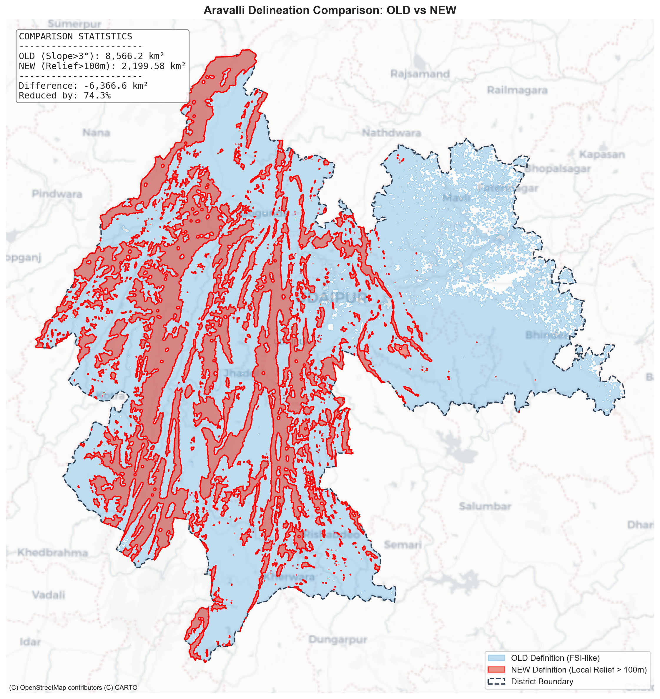
      </a>
    </td>
    <td width="33%" valign="top">
      <b>Sikar</b> (Rajasthan)<br/>
      <small>District area: 7722.5 km²</small><br/>
      <br/>
      <b>OLD:</b> 5986.3 km² (77.5%)<br/>
      <b>NEW:</b> 183.5 km² (2.4%)<br/>
      <b>Δ:</b> -5802.8 km² (-96.9%)<br/>
      <br/>
      <a href="outputs/districts/Sikar/maps/comparison_overview.png">
        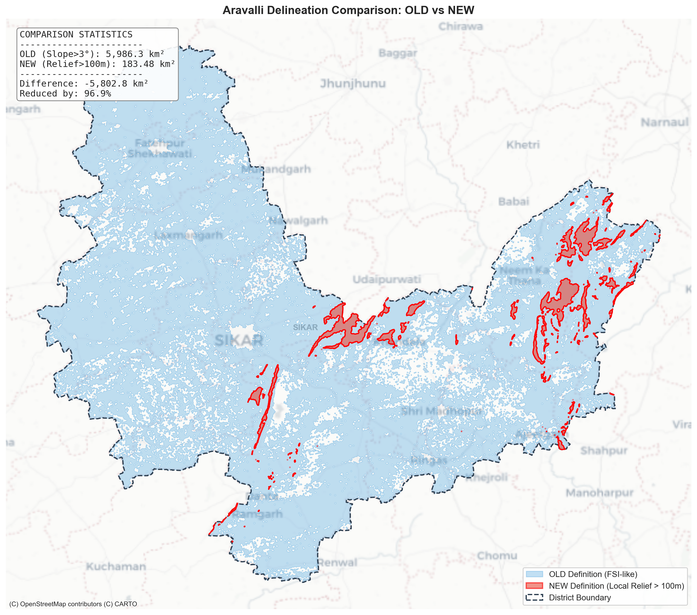
      </a>
    </td>
    <td width="33%" valign="top">
      <b>Jaipur</b> (Rajasthan)<br/>
      <small>District area: 9832.0 km²</small><br/>
      <br/>
      <b>OLD:</b> 5722.2 km² (58.2%)<br/>
      <b>NEW:</b> 198.7 km² (2.0%)<br/>
      <b>Δ:</b> -5523.5 km² (-96.5%)<br/>
      <br/>
      <a href="outputs/districts/Jaipur/maps/comparison_overview.png">
        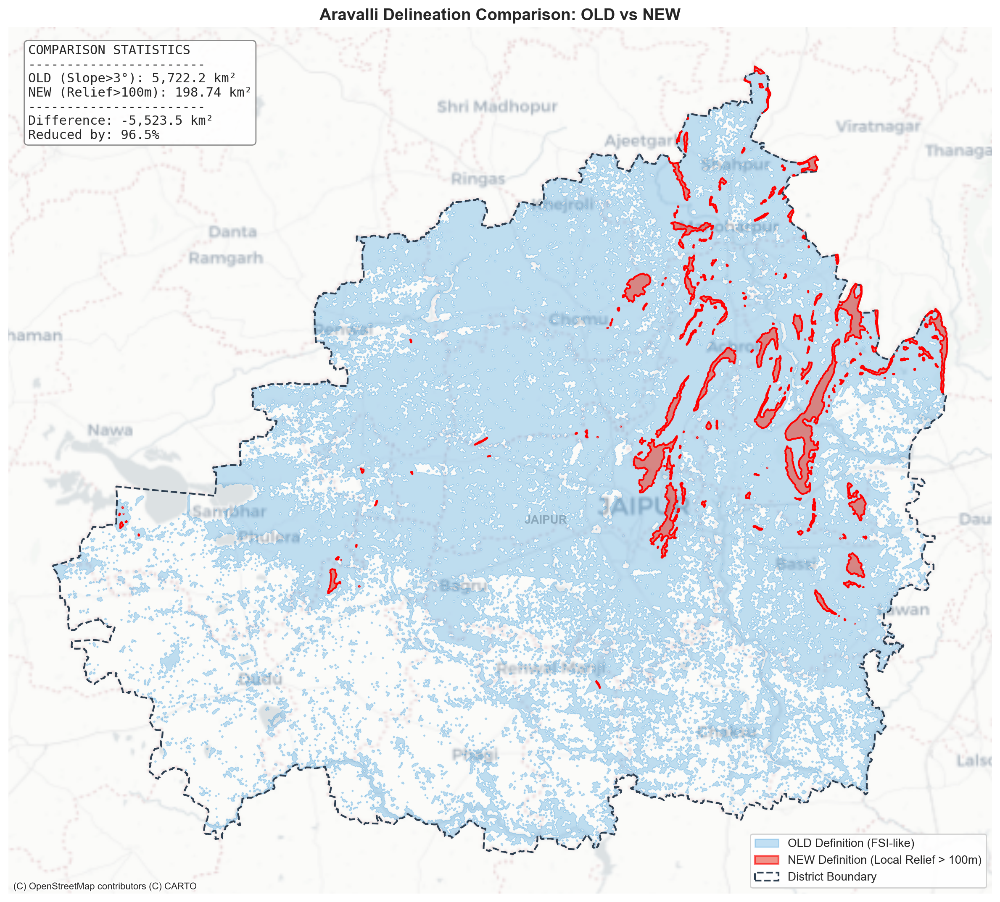
      </a>
    </td>
  </tr>
  <tr>
    <td width="33%" valign="top">
      <b>Chittorgarh</b> (Rajasthan)<br/>
      <small>District area: 7806.4 km²</small><br/>
      <br/>
      <b>OLD:</b> 4577.6 km² (58.6%)<br/>
      <b>NEW:</b> 244.2 km² (3.1%)<br/>
      <b>Δ:</b> -4333.3 km² (-94.7%)<br/>
      <br/>
      <a href="outputs/districts/Chittorgarh/maps/comparison_overview.png">
        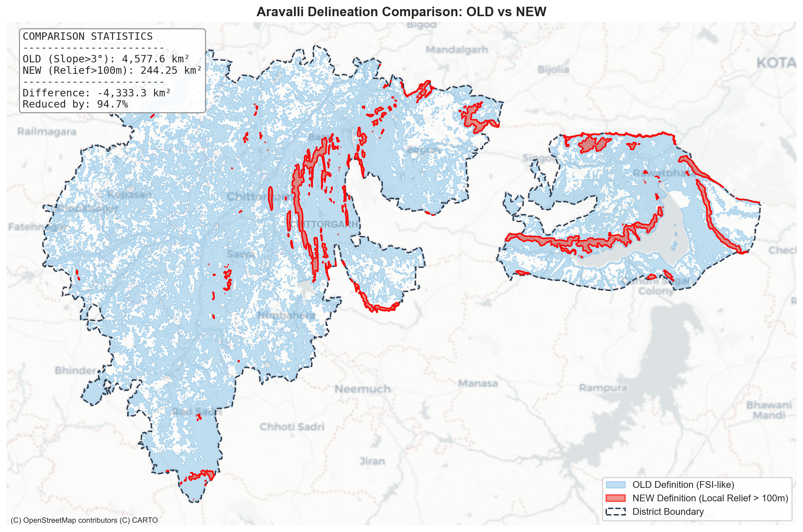
      </a>
    </td>
    <td width="33%" valign="top">
      <b>Bhilwara</b> (Rajasthan)<br/>
      <small>District area: 10056.1 km²</small><br/>
      <br/>
      <b>OLD:</b> 4095.8 km² (40.7%)<br/>
      <b>NEW:</b> 64.6 km² (0.6%)<br/>
      <b>Δ:</b> -4031.2 km² (-98.4%)<br/>
      <br/>
      <a href="outputs/districts/Bhilwara/maps/comparison_overview.png">
        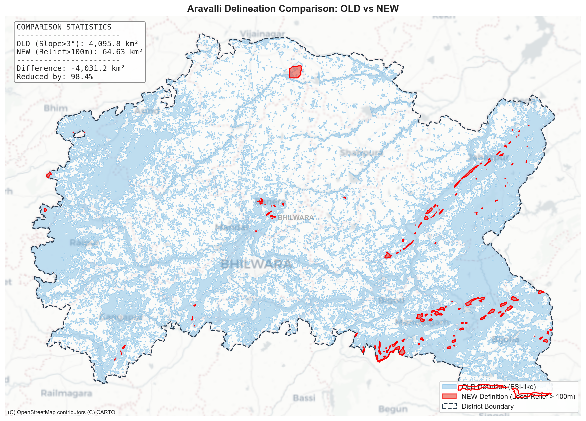
      </a>
    </td>
    <td width="33%" valign="top">
      <b>Banswara</b> (Rajasthan)<br/>
      <small>District area: 4504.4 km²</small><br/>
      <br/>
      <b>OLD:</b> 4131.0 km² (91.7%)<br/>
      <b>NEW:</b> 135.8 km² (3.0%)<br/>
      <b>Δ:</b> -3995.2 km² (-96.7%)<br/>
      <br/>
      <a href="outputs/districts/Banswara/maps/comparison_overview.png">
        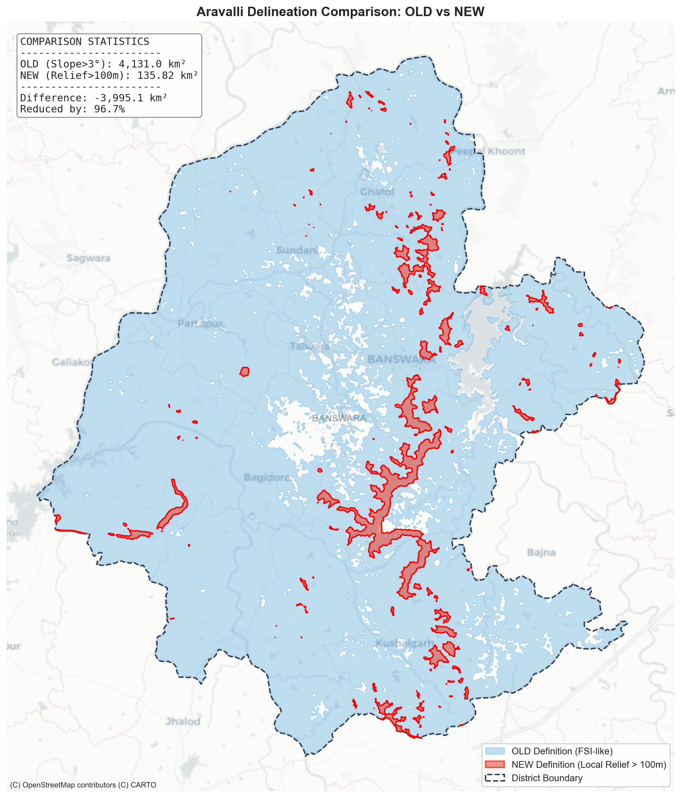
      </a>
    </td>
  </tr>
  <tr>
    <td width="33%" valign="top">
      <b>Banaskantha</b> (Gujarat)<br/>
      <small>District area: 6133.4 km²</small><br/>
      <br/>
      <b>OLD:</b> 4259.2 km² (69.4%)<br/>
      <b>NEW:</b> 373.6 km² (6.1%)<br/>
      <b>Δ:</b> -3885.6 km² (-91.2%)<br/>
      <br/>
      <a href="outputs/districts/Banaskantha/maps/comparison_overview.png">
        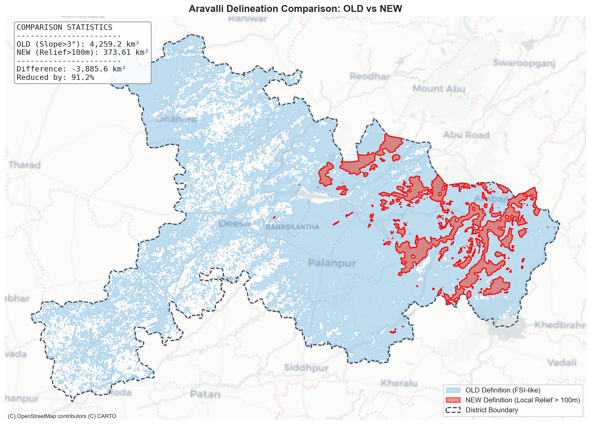
      </a>
    </td>
    <td width="33%" valign="top">
      <b>Jhunjhunu</b> (Rajasthan)<br/>
      <small>District area: 5920.9 km²</small><br/>
      <br/>
      <b>OLD:</b> 4001.9 km² (67.6%)<br/>
      <b>NEW:</b> 135.7 km² (2.3%)<br/>
      <b>Δ:</b> -3866.2 km² (-96.6%)<br/>
      <br/>
      <a href="outputs/districts/Jhunjhunu/maps/comparison_overview.png">
        
      </a>
    </td>
    <td width="33%" valign="top">
      <b>Dungarpur</b> (Rajasthan)<br/>
      <small>District area: 3777.3 km²</small><br/>
      <br/>
      <b>OLD:</b> 3730.1 km² (98.8%)<br/>
      <b>NEW:</b> 46.4 km² (1.2%)<br/>
      <b>Δ:</b> -3683.8 km² (-98.8%)<br/>
      <br/>
      <a href="outputs/districts/Dungarpur/maps/comparison_overview.png">
        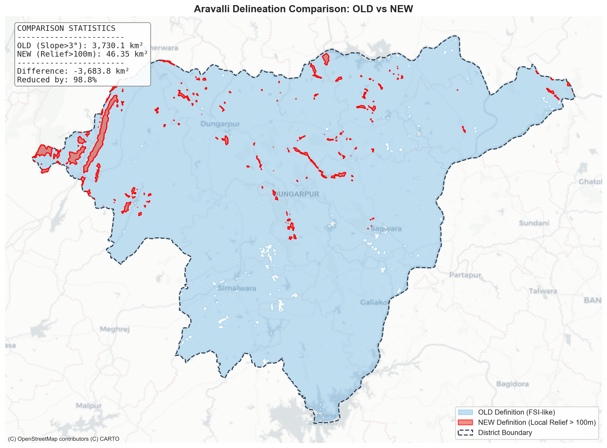
      </a>
    </td>
  </tr>
  <tr>
    <td width="33%" valign="top">
      <b>Rajsamand</b> (Rajasthan)<br/>
      <small>District area: 4631.7 km²</small><br/>
      <br/>
      <b>OLD:</b> 3944.5 km² (85.2%)<br/>
      <b>NEW:</b> 562.0 km² (12.1%)<br/>
      <b>Δ:</b> -3382.4 km² (-85.8%)<br/>
      <br/>
      <a href="outputs/districts/Rajsamand/maps/comparison_overview.png">
        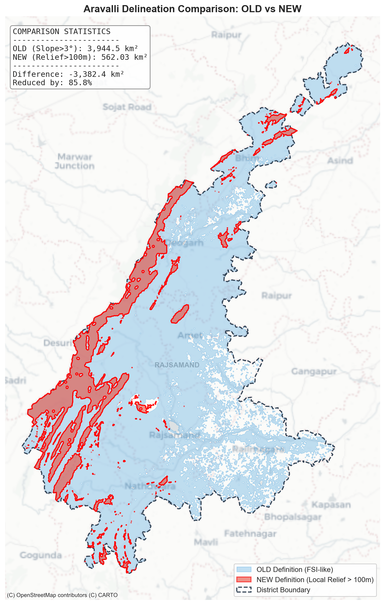
      </a>
    </td>
    <td width="33%" valign="top">
      <b>Pratapgarh</b> (Rajasthan)<br/>
      <small>District area: 4430.2 km²</small><br/>
      <br/>
      <b>OLD:</b> 3477.8 km² (78.5%)<br/>
      <b>NEW:</b> 226.2 km² (5.1%)<br/>
      <b>Δ:</b> -3251.6 km² (-93.5%)<br/>
      <br/>
      <a href="outputs/districts/Pratapgarh/maps/comparison_overview.png">
        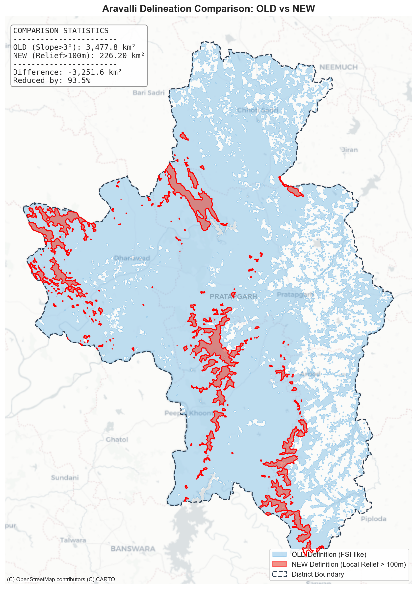
      </a>
    </td>
    <td width="33%" valign="top">
      <b>Nagaur</b> (Rajasthan)<br/>
      <small>District area: 11001.7 km²</small><br/>
      <br/>
      <b>OLD:</b> 3104.9 km² (28.2%)<br/>
      <b>NEW:</b> 3.5 km² (0.0%)<br/>
      <b>Δ:</b> -3101.5 km² (-99.9%)<br/>
      <br/>
      <a href="outputs/districts/Nagaur/maps/comparison_overview.png">
        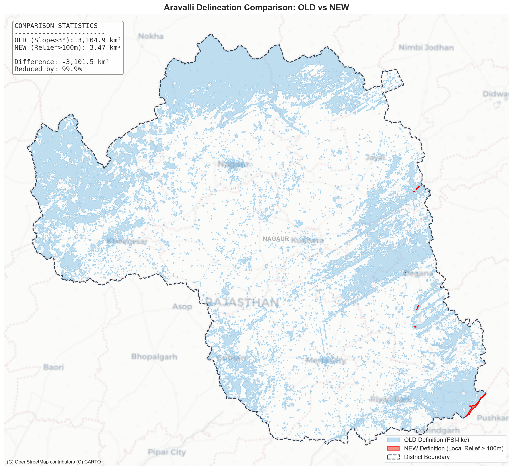
      </a>
    </td>
  </tr>
  <tr>
    <td width="33%" valign="top">
      <b>Sirohi</b> (Rajasthan)<br/>
      <small>District area: 5134.2 km²</small><br/>
      <br/>
      <b>OLD:</b> 3547.7 km² (69.1%)<br/>
      <b>NEW:</b> 798.5 km² (15.6%)<br/>
      <b>Δ:</b> -2749.1 km² (-77.5%)<br/>
      <br/>
      <a href="outputs/districts/Sirohi/maps/comparison_overview.png">
        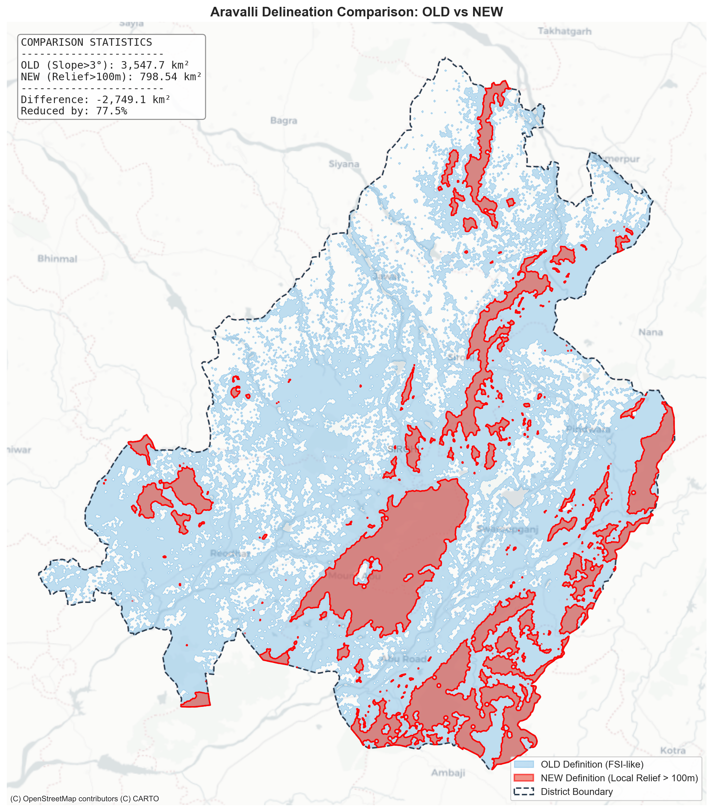
      </a>
    </td>
    <td width="33%" valign="top">
      <b>Pali</b> (Rajasthan)<br/>
      <small>District area: 9910.9 km²</small><br/>
      <br/>
      <b>OLD:</b> 2984.3 km² (30.1%)<br/>
      <b>NEW:</b> 275.3 km² (2.8%)<br/>
      <b>Δ:</b> -2709.1 km² (-90.8%)<br/>
      <br/>
      <a href="outputs/districts/Pali/maps/comparison_overview.png">
        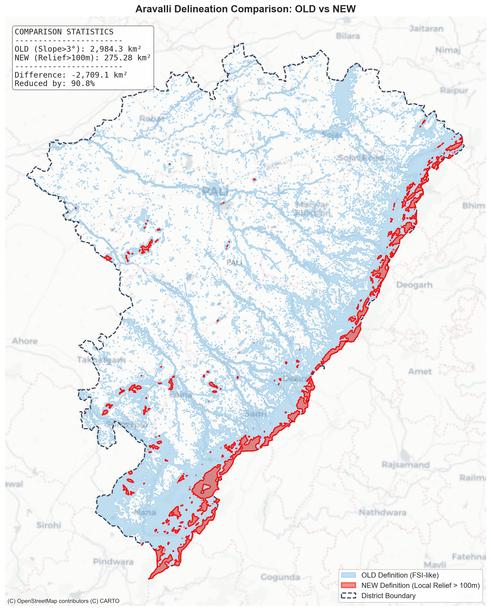
      </a>
    </td>
    <td width="33%" valign="top">
      <b>Sabarkantha</b> (Gujarat)<br/>
      <small>District area: 4144.2 km²</small><br/>
      <br/>
      <b>OLD:</b> 2801.9 km² (67.6%)<br/>
      <b>NEW:</b> 222.9 km² (5.4%)<br/>
      <b>Δ:</b> -2579.0 km² (-92.0%)<br/>
      <br/>
      <a href="outputs/districts/Sabarkantha/maps/comparison_overview.png">
        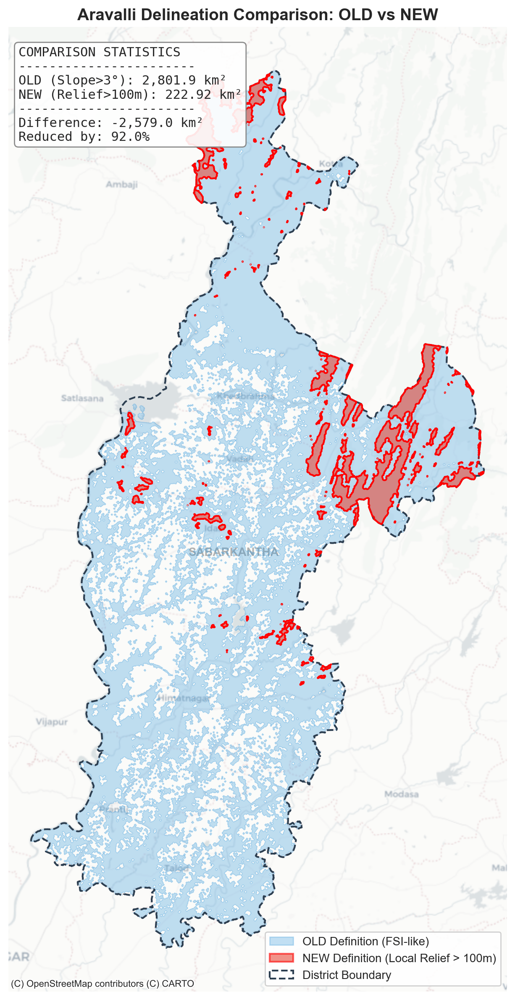
      </a>
    </td>
  </tr>
  <tr>
    <td width="33%" valign="top">
      <b>Panchmahal</b> (Gujarat)<br/>
      <small>District area: 3282.7 km²</small><br/>
      <br/>
      <b>OLD:</b> 2587.6 km² (78.8%)<br/>
      <b>NEW:</b> 44.0 km² (1.3%)<br/>
      <b>Δ:</b> -2543.7 km² (-98.3%)<br/>
      <br/>
      <a href="outputs/districts/Panchmahal/maps/comparison_overview.png">
        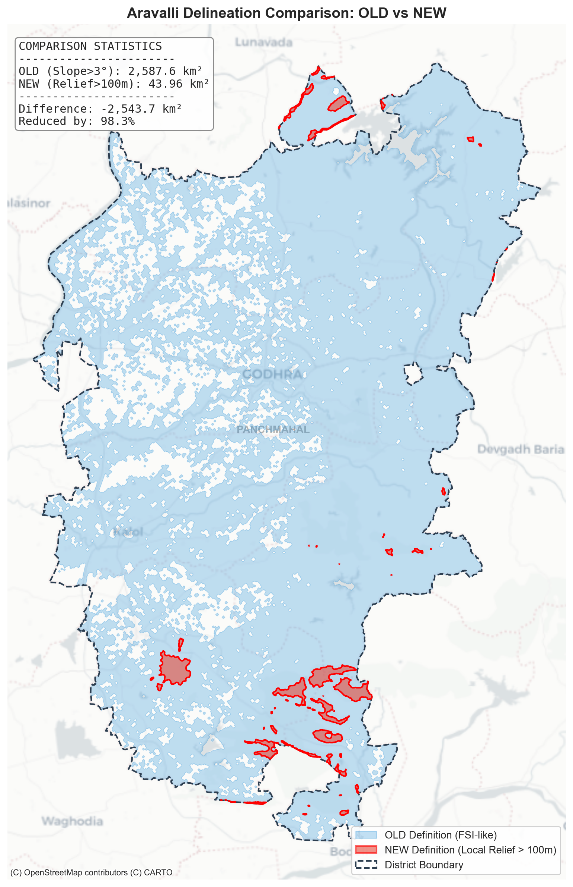
      </a>
    </td>
    <td width="33%" valign="top">
      <b>Mahesana</b> (Gujarat)<br/>
      <small>District area: 4423.7 km²</small><br/>
      <br/>
      <b>OLD:</b> 2401.6 km² (54.3%)<br/>
      <b>NEW:</b> 21.5 km² (0.5%)<br/>
      <b>Δ:</b> -2380.0 km² (-99.1%)<br/>
      <br/>
      <a href="outputs/districts/Mahesana/maps/comparison_overview.png">
        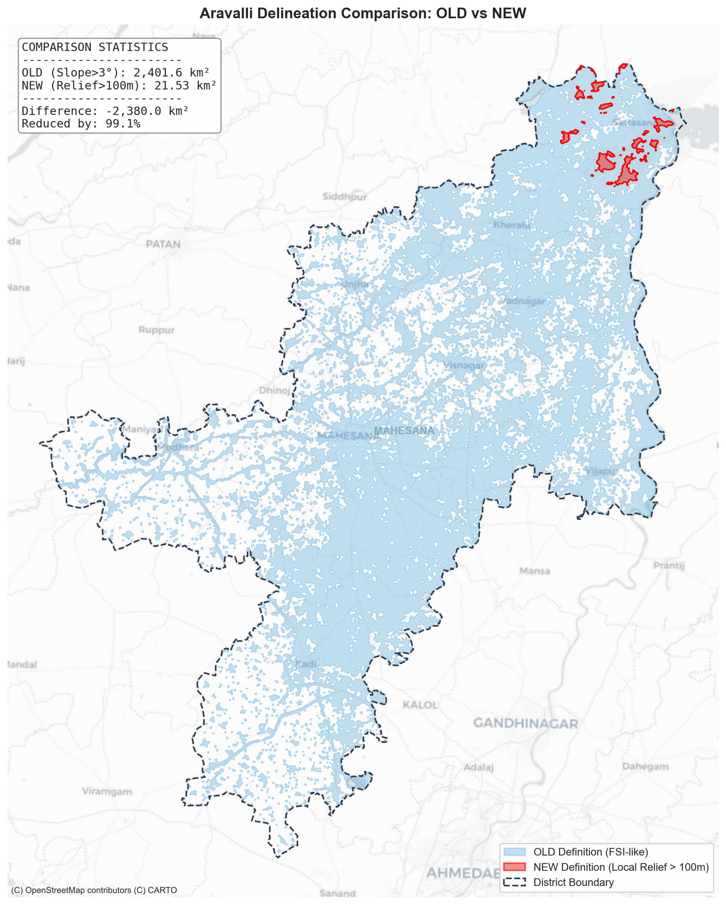
      </a>
    </td>
    <td width="33%" valign="top">
      <b>Alwar</b> (Rajasthan)<br/>
      <small>District area: 4761.9 km²</small><br/>
      <br/>
      <b>OLD:</b> 2914.6 km² (61.2%)<br/>
      <b>NEW:</b> 715.9 km² (15.0%)<br/>
      <b>Δ:</b> -2198.7 km² (-75.4%)<br/>
      <br/>
      <a href="outputs/districts/Alwar/maps/comparison_overview.png">
        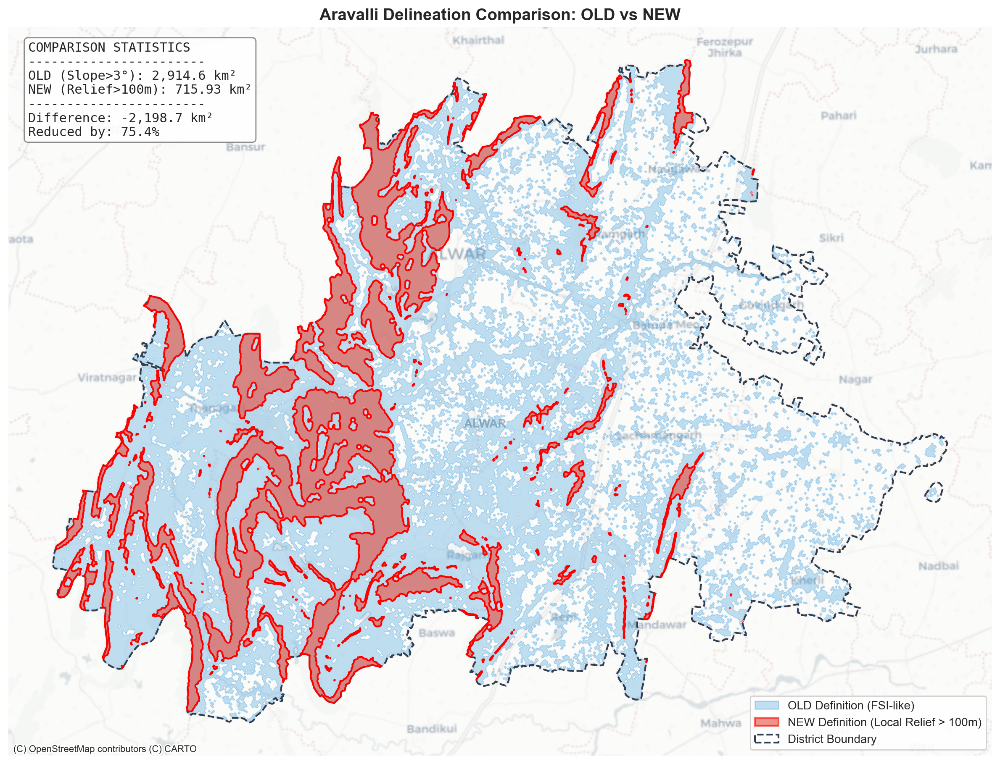
      </a>
    </td>
  </tr>
  <tr>
    <td width="33%" valign="top">
      <b>Aravalli</b> (Gujarat)<br/>
      <small>District area: 3256.5 km²</small><br/>
      <br/>
      <b>OLD:</b> 2257.7 km² (69.3%)<br/>
      <b>NEW:</b> 75.2 km² (2.3%)<br/>
      <b>Δ:</b> -2182.5 km² (-96.7%)<br/>
      <br/>
      <a href="outputs/districts/Aravalli/maps/comparison_overview.png">
        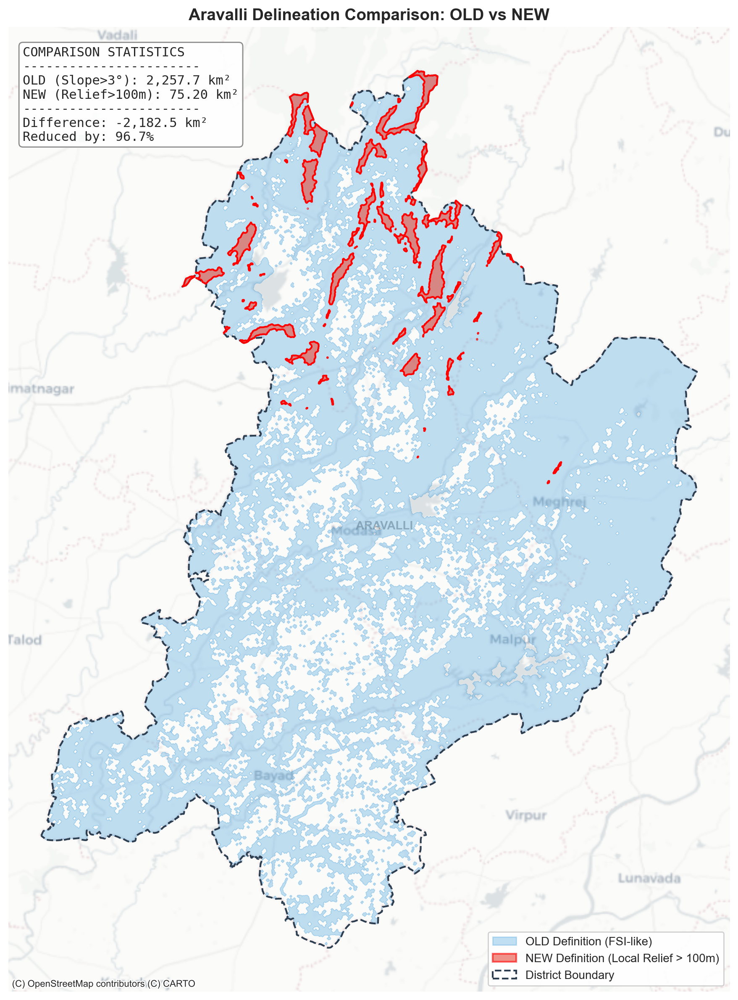
      </a>
    </td>
    <td width="33%" valign="top">
      <b>Dausa</b> (Rajasthan)<br/>
      <small>District area: 3420.8 km²</small><br/>
      <br/>
      <b>OLD:</b> 2215.1 km² (64.8%)<br/>
      <b>NEW:</b> 114.3 km² (3.3%)<br/>
      <b>Δ:</b> -2100.7 km² (-94.8%)<br/>
      <br/>
      <a href="outputs/districts/Dausa/maps/comparison_overview.png">
        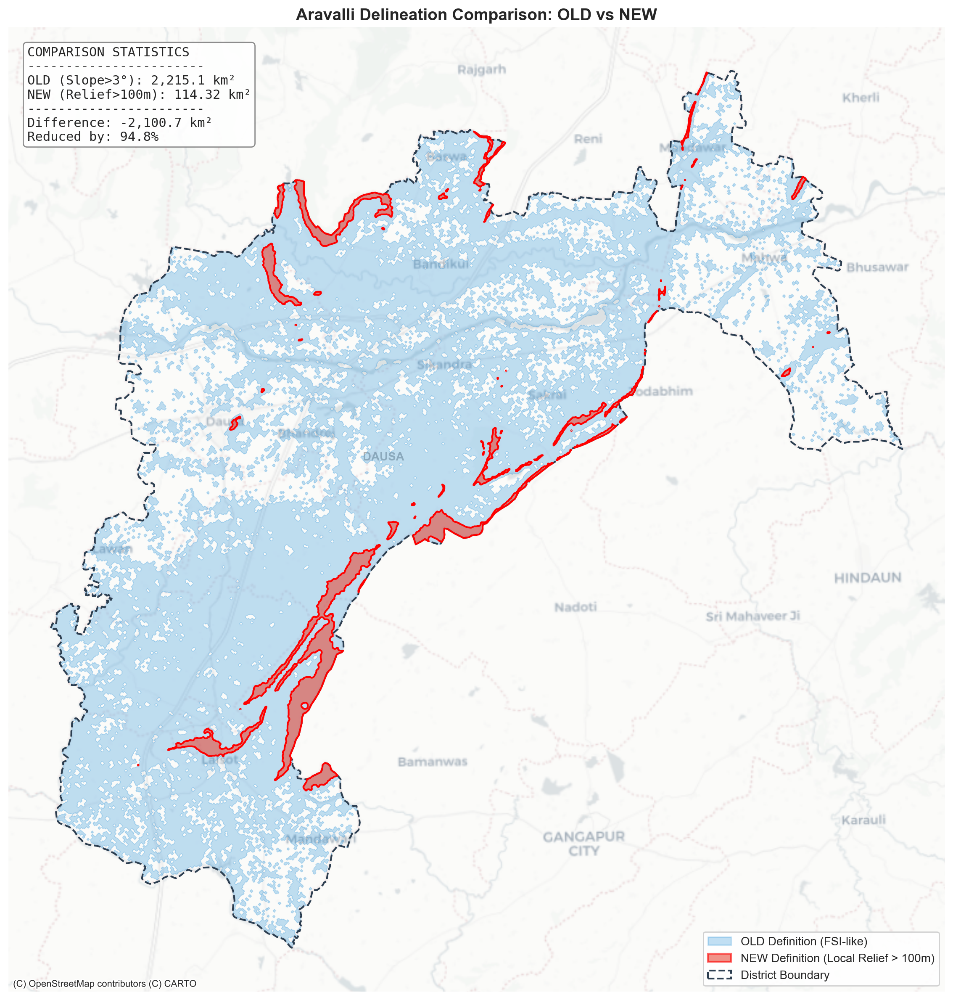
      </a>
    </td>
    <td width="33%" valign="top">
      <b>Sawai Madhopur</b> (Rajasthan)<br/>
      <small>District area: 5025.1 km²</small><br/>
      <br/>
      <b>OLD:</b> 2332.0 km² (46.4%)<br/>
      <b>NEW:</b> 327.9 km² (6.5%)<br/>
      <b>Δ:</b> -2004.2 km² (-85.9%)<br/>
      <br/>
      <a href="outputs/districts/Sawai Madhopur/maps/comparison_overview.png">
        
      </a>
    </td>
  </tr>
  <tr>
    <td width="33%" valign="top">
      <b>Bhiwani</b> (Haryana)<br/>
      <small>District area: 3288.3 km²</small><br/>
      <br/>
      <b>OLD:</b> 1733.6 km² (52.7%)<br/>
      <b>NEW:</b> 0.6 km² (0.0%)<br/>
      <b>Δ:</b> -1733.0 km² (-100.0%)<br/>
      <br/>
      <a href="outputs/districts/Bhiwani/maps/comparison_overview.png">
        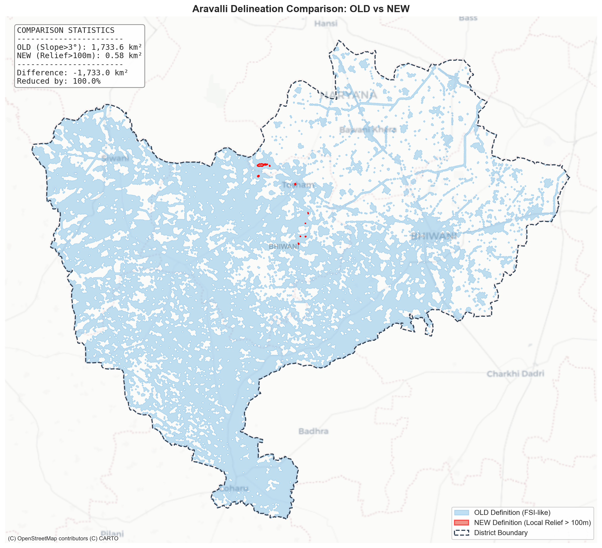
      </a>
    </td>
    <td width="33%" valign="top">
      <b>Ajmer</b> (Rajasthan)<br/>
      <small>District area: 6916.6 km²</small><br/>
      <br/>
      <b>OLD:</b> 1813.0 km² (26.2%)<br/>
      <b>NEW:</b> 103.5 km² (1.5%)<br/>
      <b>Δ:</b> -1709.5 km² (-94.3%)<br/>
      <br/>
      <a href="outputs/districts/Ajmer/maps/comparison_overview.png">
        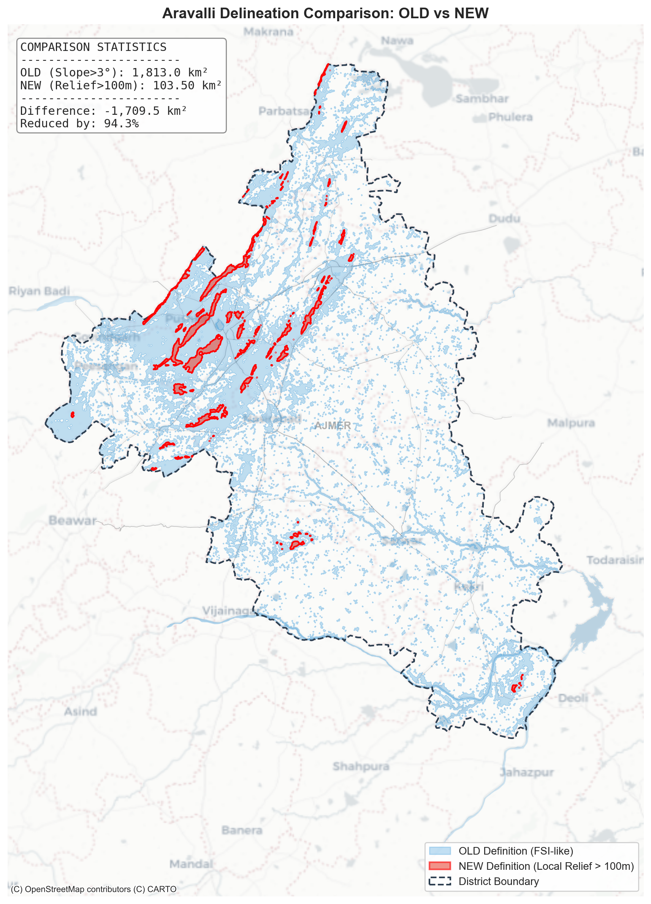
      </a>
    </td>
    <td width="33%" valign="top">
      <b>Tonk</b> (Rajasthan)<br/>
      <small>District area: 7193.6 km²</small><br/>
      <br/>
      <b>OLD:</b> 1647.8 km² (22.9%)<br/>
      <b>NEW:</b> 36.0 km² (0.5%)<br/>
      <b>Δ:</b> -1611.9 km² (-97.8%)<br/>
      <br/>
      <a href="outputs/districts/Tonk/maps/comparison_overview.png">
        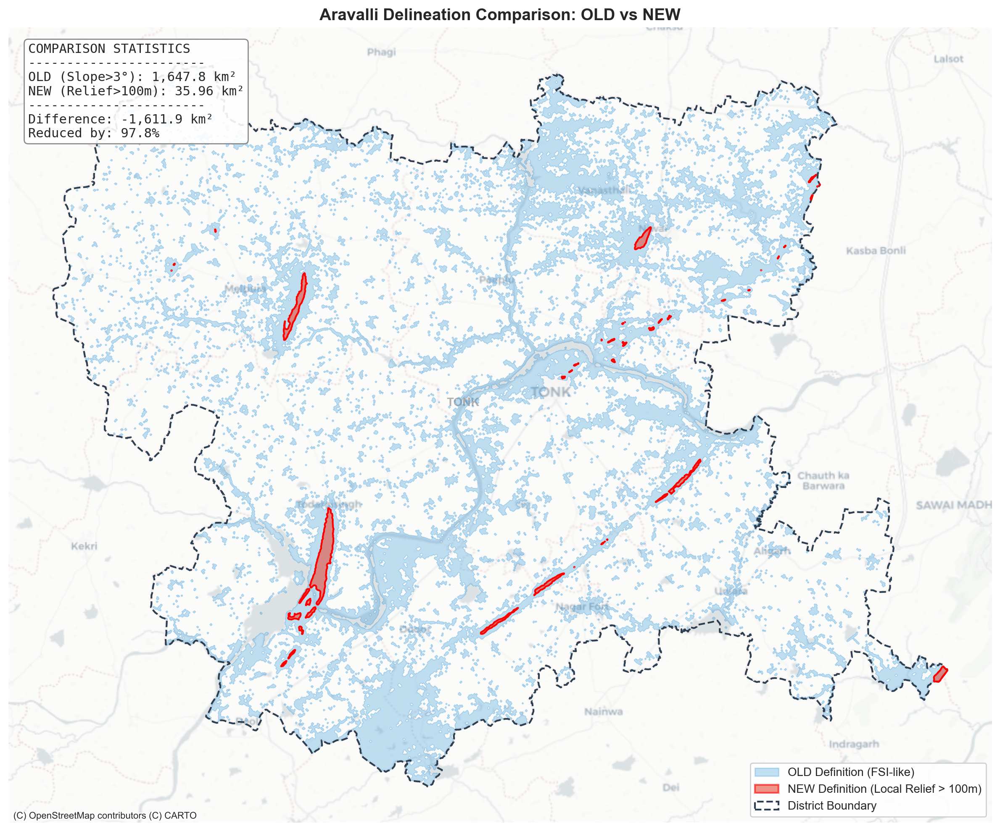
      </a>
    </td>
  </tr>
  <tr>
    <td width="33%" valign="top">
      <b>Mahendragarh</b> (Haryana)<br/>
      <small>District area: 1936.1 km²</small><br/>
      <br/>
      <b>OLD:</b> 1083.3 km² (56.0%)<br/>
      <b>NEW:</b> 17.2 km² (0.9%)<br/>
      <b>Δ:</b> -1066.2 km² (-98.4%)<br/>
      <br/>
      <a href="outputs/districts/Mahendragarh/maps/comparison_overview.png">
        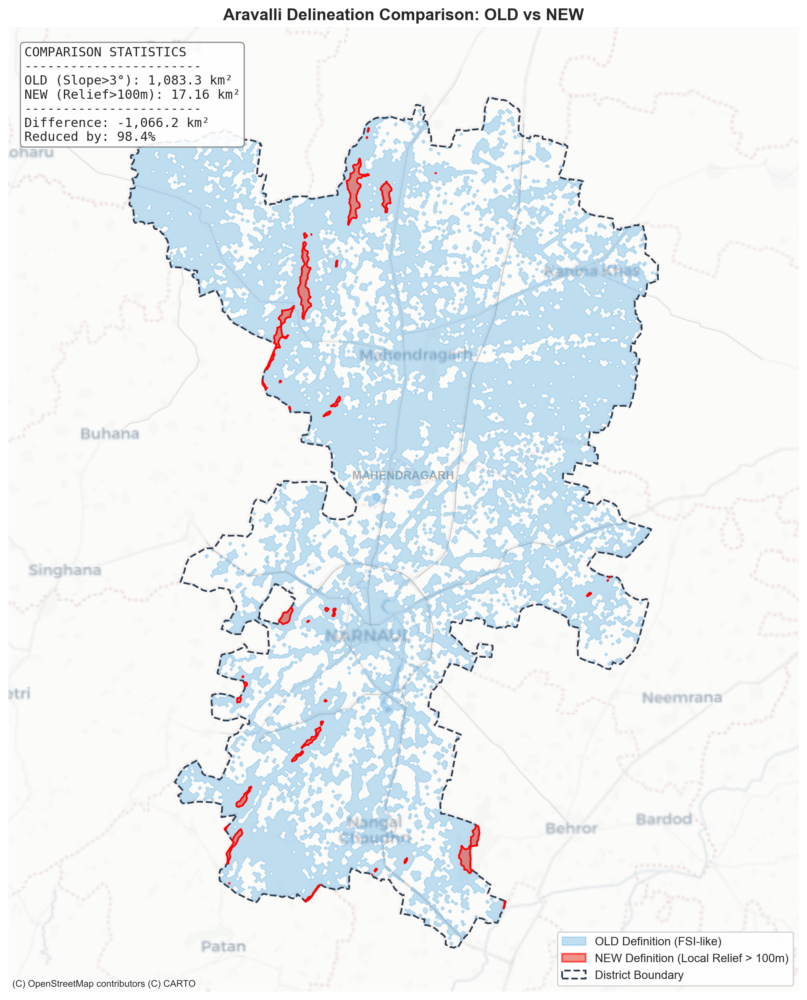
      </a>
    </td>
    <td width="33%" valign="top">
      <b>Charkhi Dadri</b> (Haryana)<br/>
      <small>District area: 1373.4 km²</small><br/>
      <br/>
      <b>OLD:</b> 719.6 km² (52.4%)<br/>
      <b>NEW:</b> 4.0 km² (0.3%)<br/>
      <b>Δ:</b> -715.7 km² (-99.4%)<br/>
      <br/>
      <a href="outputs/districts/Charkhi Dadri/maps/comparison_overview.png">
        
      </a>
    </td>
    <td width="33%" valign="top">
      <b>Gurugram</b> (Haryana)<br/>
      <small>District area: 1252.7 km²</small><br/>
      <br/>
      <b>OLD:</b> 597.1 km² (47.7%)<br/>
      <b>NEW:</b> 0.2 km² (0.0%)<br/>
      <b>Δ:</b> -596.9 km² (-100.0%)<br/>
      <br/>
      <a href="outputs/districts/Gurugram/maps/comparison_overview.png">
        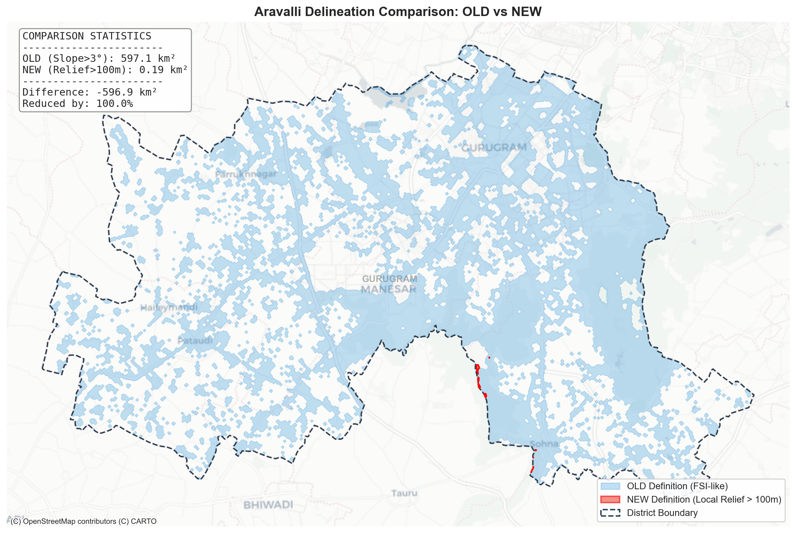
      </a>
    </td>
  </tr>
  <tr>
    <td width="33%" valign="top">
      <b>Rewari</b> (Haryana)<br/>
      <small>District area: 1564.0 km²</small><br/>
      <br/>
      <b>OLD:</b> 580.4 km² (37.1%)<br/>
      <b>NEW:</b> 4.2 km² (0.3%)<br/>
      <b>Δ:</b> -576.2 km² (-99.3%)<br/>
      <br/>
      <a href="outputs/districts/Rewari/maps/comparison_overview.png">
        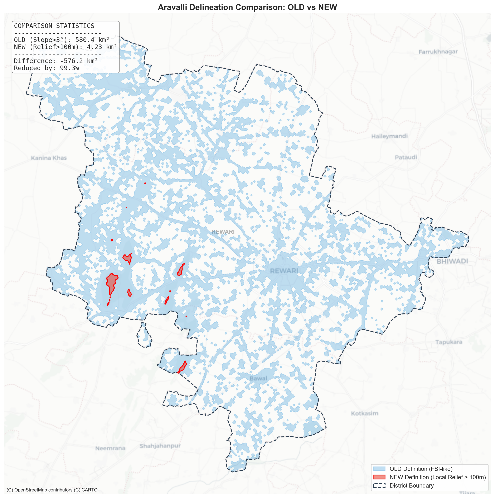
      </a>
    </td>
    <td width="33%" valign="top">
      <b>Nuh</b> (Haryana)<br/>
      <small>District area: 1505.4 km²</small><br/>
      <br/>
      <b>OLD:</b> 453.4 km² (30.1%)<br/>
      <b>NEW:</b> 56.9 km² (3.8%)<br/>
      <b>Δ:</b> -396.4 km² (-87.4%)<br/>
      <br/>
      <a href="outputs/districts/Nuh/maps/comparison_overlay.png">
        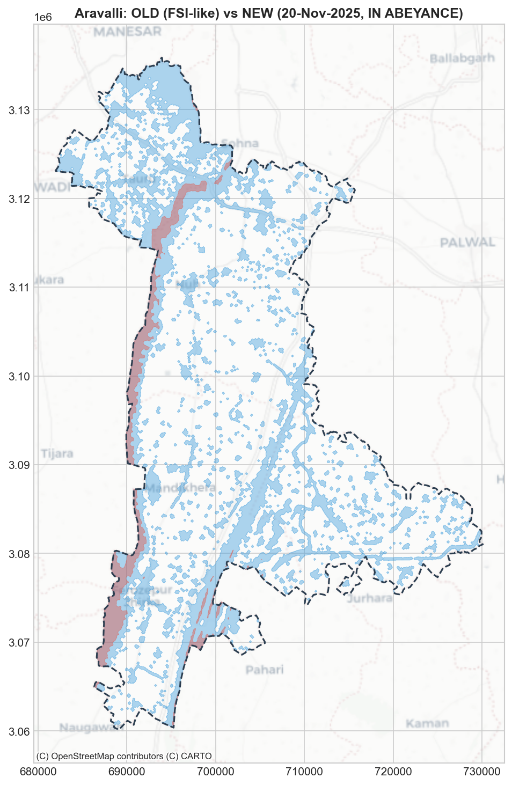
      </a>
    </td>
    <td width="33%" valign="top">
      <b>Faridabad</b> (Haryana)<br/>
      <small>District area: 746.6 km²</small><br/>
      <br/>
      <b>OLD:</b> 393.6 km² (52.7%)<br/>
      <b>NEW:</b> 0.0 km² (0.0%)<br/>
      <b>Δ:</b> -393.6 km² (-100.0%)<br/>
      <br/>
      <a href="outputs/districts/Faridabad/maps/comparison_overview.png">
        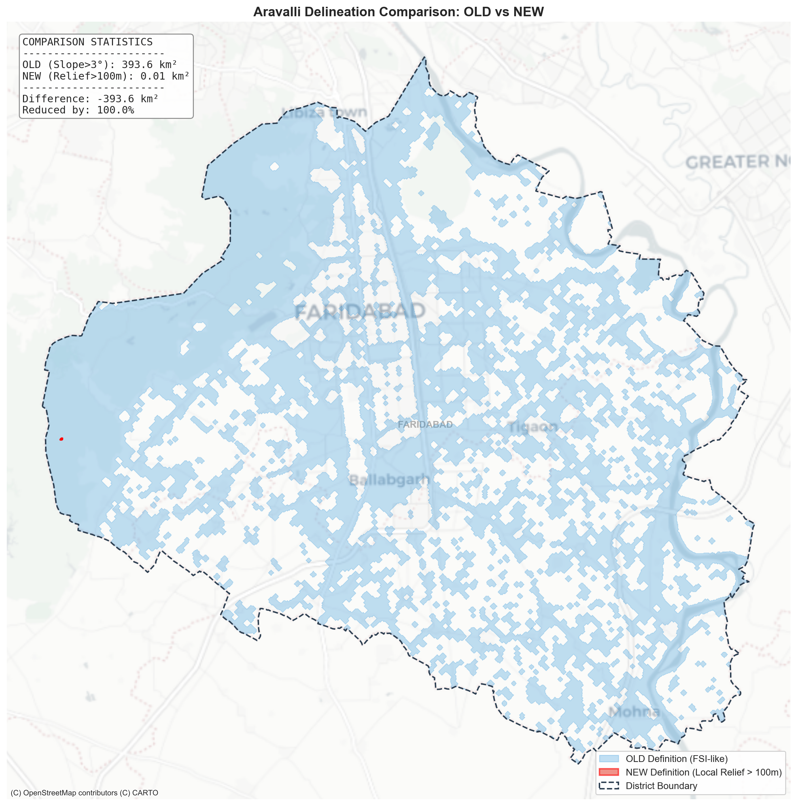
      </a>
    </td>
  </tr>
  <tr>
    <td width="33%" valign="top">
      <b>South Delhi</b> (Delhi)<br/>
      <small>District area: 150.4 km²</small><br/>
      <br/>
      <b>OLD:</b> 127.3 km² (84.7%)<br/>
      <b>NEW:</b> 0.0 km² (0.0%)<br/>
      <b>Δ:</b> -127.3 km² (-100.0%)<br/>
      <br/>
      <a href="outputs/districts/South Delhi/maps/comparison_overview.png">
        
      </a>
    </td>
    <td width="33%" valign="top">
      <b>South West Delhi</b> (Delhi)<br/>
      <small>District area: 283.8 km²</small><br/>
      <br/>
      <b>OLD:</b> 123.9 km² (43.6%)<br/>
      <b>NEW:</b> 0.0 km² (0.0%)<br/>
      <b>Δ:</b> -123.9 km² (-100.0%)<br/>
      <br/>
      <a href="outputs/districts/South West Delhi/maps/comparison_overview.png">
        
      </a>
    </td>
    <td width="33%" valign="top">
      <b>New Delhi</b> (Delhi)<br/>
      <small>District area: 161.4 km²</small><br/>
      <br/>
      <b>OLD:</b> 87.4 km² (54.2%)<br/>
      <b>NEW:</b> 0.0 km² (0.0%)<br/>
      <b>Δ:</b> -87.4 km² (-100.0%)<br/>
      <br/>
      <a href="outputs/districts/New Delhi/maps/comparison_overview.png">
        
      </a>
    </td>
  </tr>
  <tr>
    <td width="33%" valign="top">
      <b>Central Delhi</b> (Delhi)<br/>
      <small>District area: 89.2 km²</small><br/>
      <br/>
      <b>OLD:</b> 64.7 km² (72.5%)<br/>
      <b>NEW:</b> 0.0 km² (0.0%)<br/>
      <b>Δ:</b> -64.7 km² (-100.0%)<br/>
      <br/>
      <a href="outputs/districts/Central Delhi/maps/comparison_overview.png">
        
      </a>
    </td>
  </tr>
</table>

#### District Analysis Legend

- **District area**: Total administrative area (km²)
- **OLD**: FSI-2010-like delineation (slope > 3° + buffers)
- **NEW**: SC 20-Nov-2025 definition (≥100 m local relief)
- **Δ**: Change from OLD to NEW (negative = area lost)
- **Percentages**: Share of total district area classified as Aravalli

### 8.3 Why OLD and NEW Differ

| Factor | Effect |
|--------|--------|
| **Slope vs. Relief** | OLD uses slope gradient; NEW uses elevation difference from local "base". Gentle slopes on high plateaus may meet OLD but not NEW. Steep but short hills may meet OLD but fail 100m relief threshold. |
| **100m Relief Threshold** | NEW has a hard 100m minimum; many Aravalli foothills in Haryana are 50-80m above surroundings and are excluded. |
| **Local Relief Calculation** | The "lowest contour encircling landform" interpretation is ambiguous. Our approximation (minimum filter or contour-based) may differ from Survey of India's methodology. |
| **Buffer/Bridging** | OLD's 100m foothill buffer and 500m gap bridging expand coverage; NEW's 500m range proximity operates differently (merges distinct hills, doesn't buffer foothill zone). |

### 8.4 Validation Recommendations

To validate results for a specific region:

- **Cross-check Rajasthan totals** with published Geological Survey of India (GSI) reports
- **Sensitivity analysis**: Re-run with different relief radius values (1500m, 2500m, 3000m) and compare
- **Contour method comparison**: Use contour-based approach with 5m, 10m, and 20m intervals
- **Boundary verification**: Compare OSM district boundaries against official Census/SOI shapefiles
- **Ground truthing**: Visit representative districts and verify classification on the ground

---

## 9. Limitations & Caveats

### 9.1 Data Limitations

| Limitation | Impact | Mitigation |
|------------|--------|------------|
| SRTM vertical accuracy (±16m) | May misclassify areas near 100m threshold | Use higher-quality DEM if available |
| SRTM is a DSM (includes canopy) | Forested hills may appear higher | Use bare-earth DEM if available |
| District boundaries from OSM | May differ from official Survey of India boundaries | Use official shapefiles if available |
| 30m horizontal resolution | Small features (<30m) not resolved | Use higher-resolution DEM (e.g., ALOS, Cartosat) |

### 9.2 Methodological Limitations

| Limitation | Impact |
|------------|--------|
| **"Lowest contour encircling landform" approximation** | The legal definition refers to Survey of India toposheets; our contour-based method uses DEM-derived contours at configurable intervals. This is an approximation. |
| **Morphological closing for gap bridging** | The 500m gap bridging uses geometric buffer-dissolve-buffer; this may not match the FSI's actual implementation. |
| **Local relief filter vs. contours** | The quick method (minimum filter) is a further approximation; the "radius" parameter significantly affects results. |
| **No ground-truthing** | This is a remote sensing approach; no field verification. |

### 9.3 What Would Be Needed for Litigation-Grade Mapping

For outputs to be defensible in legal proceedings:

1. **Survey of India (SOI) toposheets** (5m or 10m contour intervals) as the elevation source
2. **Official district boundary shapefiles** from Census/Revenue departments
3. **Ground-truth verification** of key boundary points
4. **Expert affidavit** from a licensed surveyor
5. **Clear chain of custody** for all input data
6. **Methodology review** by MoEFCC-appointed technical committee

**This tool is intended for research, planning, and advocacy purposes—not as a substitute for official survey outputs.**

---

## 10. License & Citation

### 10.1 Software License

This software is released under the **MIT License**. See [LICENSE](LICENSE) for details.

### 10.2 Data Licenses

| Data | License | Attribution |
|------|---------|-------------|
| SRTM DEM | Public Domain | NASA/USGS |
| OpenStreetMap | ODbL | © OpenStreetMap contributors |
| Basemap tiles | Various | See tile provider attribution |

### 10.3 Citation

If you use this tool in research or publications, please cite:

```bibtex
@software{aravalli_delineation_2025,
  title = {Aravalli Range Delineation Comparison Tool},
  author = {[Your Name/Organization]},
  year = {2025},
  url = {https://github.com/[your-repo]},
  note = {Compares FSI-2010-like and SC 20-Nov-2025 operational definitions}
}
```

### 10.4 Legal Disclaimer

**This tool provides approximate geospatial analysis for research and advocacy purposes only.** The outputs:

- Are **NOT** official government products
- Are **NOT** intended to replace Survey of India or MoEFCC official delineations
- Should **NOT** be used as legal evidence without expert review and validation
- Reflect **approximations** of the published legal definitions using publicly available DEM data

The creators assume no liability for decisions made based on these outputs.

---

## 11. Contributing

Contributions are welcome! Please:

1. Open an issue to discuss proposed changes
2. Follow PEP 8 style guidelines
3. Add tests for new functionality
4. Update documentation as needed

---

## 12. Acknowledgments

- OpenStreetMap contributors for boundary data
- NASA/USGS for SRTM elevation data
- The legal and environmental advocacy community working on Aravalli protection
- [contextily](https://github.com/geopandas/contextily) for basemap integration

---

*Last updated: 31 December 2025*
